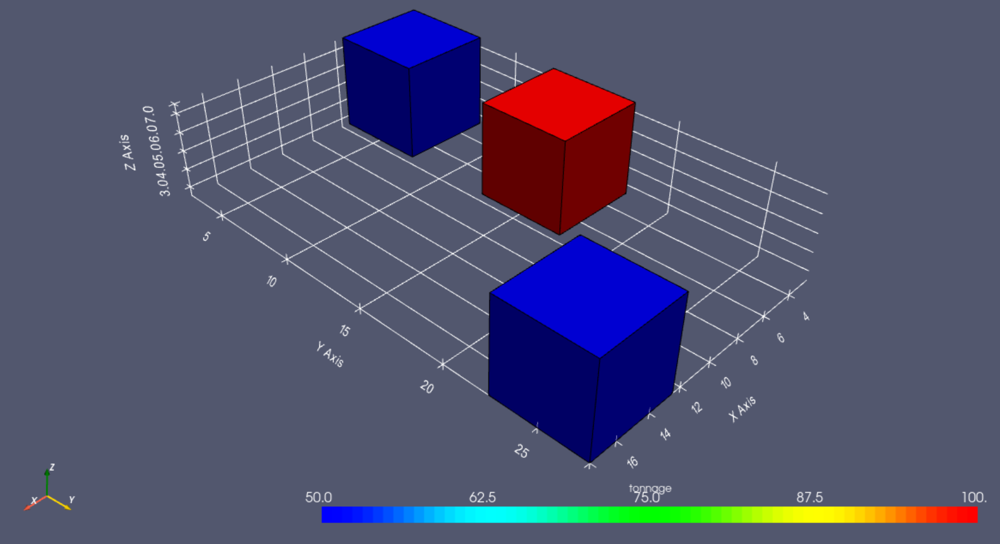

# MiningPy Documentation


Version:        0.6.1

Documentation:  https://miningpy.readthedocs.io/en/latest/

Repository:     https://bitbucket.org/incitron/miningpy

Stable Release:

- https://anaconda.org/miningpy/miningpy
- https://pypi.org/project/miningpy/

Nightly Release: Version Format: `version.version.version.yyyyMMddHHmm`

- https://anaconda.org/miningpy_nightly/miningpy
- https://test.pypi.org/project/miningpy/

Testing Pipelines (Azure DevOps): https://dev.azure.com/Iain123/MiningPy


## About
MiningPy is intended to help mining engineers harness the full power of the Python ecosystem to solve routine mine planning problems.
This package includes tools to help with:

- Block model manipulation:
    - Indexing (ijk)
    - Reblocking (geometric & attribute based)
    - Rotations
    - Calculating the model framework (origin, dimensions, rotation, extents, etc...)
    - Validating the block model (missing internal blocks, checking the model is regular, etc...)
    - Creating bench reserves
    - Aggregatng blocks for scheduling
    - Haulage modelling & encoding to the block model
- Interfacing with commercial mine planning packages, such as:
    - Maptek Vulcan
    - GEOVIA Whittle
    - COMET
    - Minemax Scheduler/Tempo
    - Datamine
- Visualisation:
    - Previewing block models directly in Python for fast reviewing of work
    - Previewing designs (.dxf) directly in Python
    - Exporting block models in [Paraview](https://www.paraview.org/) compatible format


## Why MiningPy?

There are numerous geological packages that have been written in Python, such as [GemPy](https://www.gempy.org), [PyGSLIB](https://opengeostat.github.io/pygslib), and [GeostatsPy](https://github.com/GeostatsGuy/GeostatsPy).
However, none of these packages directly provide any tools to handle mining engineering specific problems.
MiningPy aims to provide a simple API to mining engineers that extends existing data science tools like [Pandas](https://pandas.pydata.org), without having to re-invent the wheel every time they need to interface with commercial mine planning software or manipulate mining data.


## Installation

MiningPy is distributed using:
 
- [conda-forge](https://anaconda.org/conda-forge/miningpy)
- [Anaconda Cloud](https://anaconda.org/miningpy/miningpy) 
- [PyPi](https://pypi.org/project/miningpy/) 

### Conda

MiningPy can be installed using the Conda package manager.
To install using `conda`, you need to add the `conda-forge` channel
so that all dependencies are installed correctly:

```bat
conda config --add channels conda-forge 
```

To install from [conda-forge](https://anaconda.org/conda-forge/miningpy) (after adding the conda-forge channel):

```bat
conda install miningpy
```

To install from [Anaconda Cloud](https://anaconda.org/miningpy/miningpy) (after adding the conda-forge channel):

```bat
conda install -c miningpy miningpy
```

### Pip

MiningPy can be installed using the Pip package manager:

```bat
pip install miningpy
```

## Example

The following example illustrates the visualisation capabilities of MiningPy:
```python
import pandas as pd
import miningpy

blockModelData = {
    'x': [5, 5, 15],
    'y': [5, 15, 25],
    'z': [5, 5, 5],
    'tonnage': [50, 100, 50],
}

blockModel = pd.DataFrame(blockModelData)
blockModel.plot3D(
    xyz_cols=('x', 'y', 'z'),
    dims=(5, 5, 5),  # block dimensions (5m * 5m * 5m)
    col='tonnage',  # block attribute to colour by
)
```


## Documentation

Auto-generated documentation is hosted at [Read The Docs](https://miningpy.readthedocs.io/en/latest/)

You may also build the documentation yourself:

```bash
git clone https://bitbucket.org/incitron/miningpy/miningpy.git
cd miningpy/docs
make html
```

The documention can then be found in `miningpy/docs/_build/html/index.html`.


## Supported Platforms & Testing

### Platforms

MiningPy is only tested on Microsoft Windows 10.

### Testing

The package is built and tested nightly using environments based on [Virtualenv](https://virtualenv.pypa.io/) and [Conda](https://docs.conda.io) (with the current base Anaconda packages).

[Azure DevOps](https://dev.azure.com/Iain123/MiningPy) hosts and runs and the testing pipelines.

MiningPy is tested to be fully tested with the following versions of Python:

- Python 3.9
- Python 3.8
- Python 3.7

Offical testing and support has been removed for the following versions of Python (although MiningPy might still work with them):

- Python 3.6

VTK is a dependency of MiningPy and there are known issues with the current Linux version of VTK published on [PyPi](https://pypi.org/project/vtk/).

The package is also automatically deployed nightly to [TestPyPi](https://test.pypi.org/project/miningpy/), to ensure that official package releases are stable.
The versioning format used on TestPyPi is: `version.version.version.yyyyMMddHHmm`.

## API Reference


## Author

The creator of MiningPy is a mining engineer consultant that primarly works in long-term strategic mine planning.


## Contributing

Contributions to the MiningPy package are welcome. 
Please refer to the [Contributing Guide](CONTRIBUTING.md) for detailed information.


## License
MiningPy is licensed under the very liberal [MIT License](http://opensource.org/licenses/mit-license.php).
